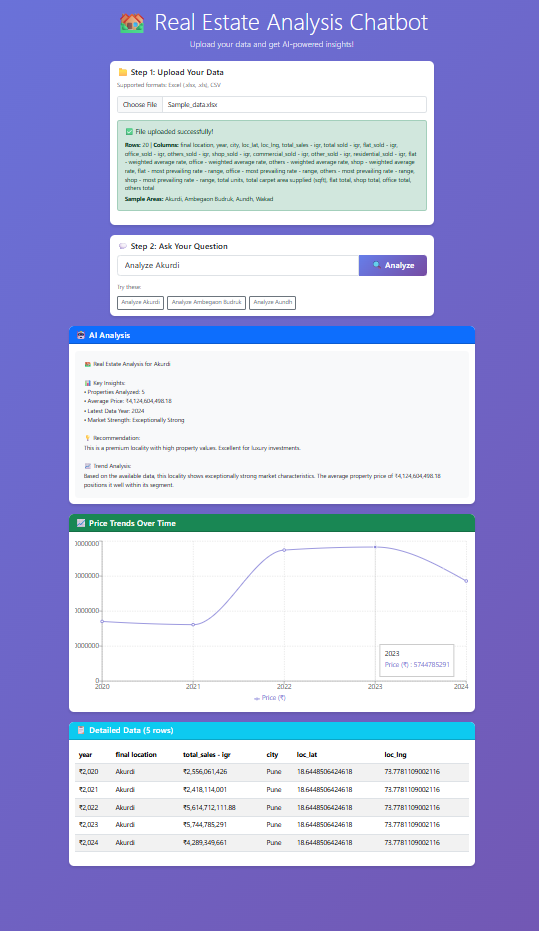
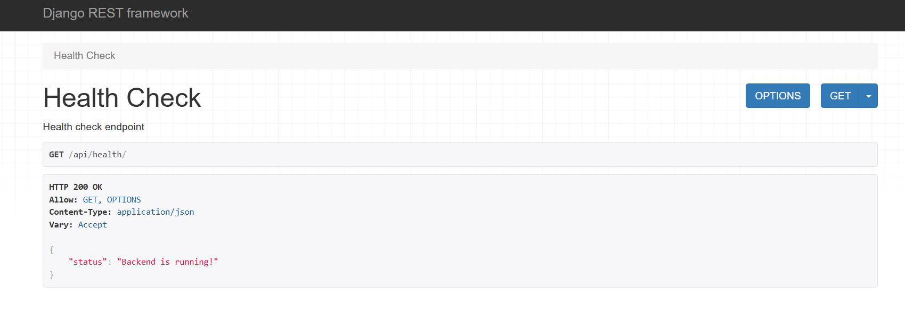
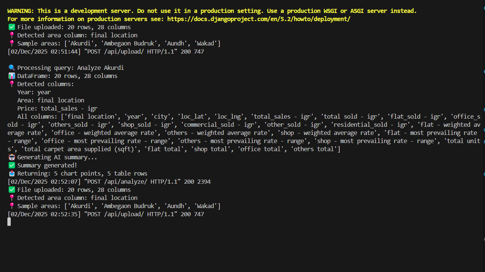

# Real Estate Analysis Chatbot

A full-stack AI-assisted real-estate analytics platform built using Django + React.

## 🌟 Overview

The Real Estate Analysis Chatbot is a web-based analytical tool that accepts user queries about different areas (e.g., "Analyze Wakad"), processes a real-estate dataset (Excel), and returns:

- ✔ Smart natural-language summary (mock or LLM)
- ✔ Price & demand trend charts
- ✔ Interactive data table
- ✔ CSV download
- ✔ Optional file upload
- ✔ Modern clean UI
- ✔ Secure API-key management through `.env`

---

## 🖼️ Project Preview

### Website Preview



### Backend Preview

[Django API Response Screenshot]
[Terminal Logs of API queries]

### Demo Video
file:///E:/Users/DELL/Downloads/React%20App%20-%20Brave%202025-12-02%2002-11-13%20(1).mp4


---

## 📚 Table of Contents

- ⚡ [Features](#features)
- 🏗 [Technology Stack](#technology-stack)
- 📂 [Project Structure](#project-structure)
- 🚀 [Getting Started](#getting-started)
- 🔌 [Backend Setup (Django)](#backend-setup-django)
- 💻 [Frontend Setup (React)](#frontend-setup-react)
- 🔥 [API Endpoints](#api-endpoints)
- 🔐 [Environment Variables (Security)](#environment-variables-security)
- 📊 [Dataset Format](#dataset-format)
- 🧠 [LLM Integration (OpenAI)](#llm-integration-openai)
- 📦 [Deployment Guide](#deployment-guide)
- 🧑‍💻 [Contributing](#contributing)
- 🛡 [Security Notes](#security-notes)
- 📝 [License](#license)
- 👨‍💻 [Author](#author)

---

## ⚡ Features

### 🔍 Smart Analysis
- Accepts area queries (e.g., "Wakad", "Compare Aundh and Ambegaon Budruk")
- Backend filters Excel rows for selected areas
- Generates summary (mock or LLM)

### 📈 Interactive Charts
- Price trend per year
- Demand trend per year
- Chart.js + react-chartjs-2 components

### 🧾 Data Table
- Fully scrollable
- Dynamic
- Paginated or full scroll
- CSV download

### 📤 Upload Excel file
- Allows overriding the preloaded dataset.

### 🧠 LLM Support
- Optional OpenAI integration
- Secure `.env` key handling

---

## 🏗 Technology Stack

| Layer          | Tech                                                   |
|----------------|--------------------------------------------------------|
| Frontend       | React, Bootstrap, Chart.js, Axios                      |
| Backend        | Django, DRF, pandas, openpyxl                          |
| Data Storage   | Excel file (.xlsx), Pandas DataFrame                   |
| Optional AI    | OpenAI GPT-4o / GPT-4o-mini                             |
| Deployment     | Vercel (frontend) + Render/Heroku (backend)            |

---

## 📂 Project Structure
real-estate-chatbot/
│
├── backend/
│ ├── project/ # Django project settings
│ ├── api/ # API app
│ │ ├── views.py # Endpoints (analyze, upload, download)
│ │ ├── utils.py # Excel parsing, filtering, chart logic
│ │ ├── urls.py # API URLs
│ ├── data/
│ │ └── sample_real_estate.xlsx
│ ├── requirements.txt
│ ├── manage.py
│
├── frontend/
│ ├── src/
│ │ ├── components/ # ChatInput, TrendChart, DataTable, SummaryCard
│ │ ├── App.js # Main UI logic
│ │ └── index.js
│ └── package.json
│
├── README.md
├── CONTRIBUTING.md


---

## 🚀 Getting Started

### 📥 Clone the repository

```bash
git clone https://github.com/vighneshtule/real-estate-chatbot.git
cd real-estate-chatbot
🔌 Backend Setup (Django)
1️⃣ Create a virtual environment

bash
Copy code
cd backend
python -m venv venv
venv\Scripts\Activate.ps1
2️⃣ Install dependencies

bash
Copy code
pip install -r requirements.txt
3️⃣ Run migrations

bash
Copy code
python manage.py migrate
4️⃣ Add .env file (Required for LLM & Secrets)

Create: backend/.env

txt
Copy code
DJANGO_SECRET_KEY=your_django_secret
DJANGO_DEBUG=True
OPENAI_API_KEY=your_api_key_here
5️⃣ Run server

bash
Copy code
python manage.py runserver
Backend runs at:

👉 http://127.0.0.1:8000/

💻 Frontend Setup (React)
1️⃣ Install dependencies

bash
Copy code
cd frontend
npm install
2️⃣ Run frontend dev server

bash
Copy code
npm start
Frontend runs at:

👉 http://localhost:3000/

🔥 API Endpoints
1. ▶ POST /api/analyze/
Request:

json
Copy code
{ "areas": ["Wakad"] }
Response:

json
Copy code
{
  "summary": "Wakad shows increasing demand...",
  "price_chart": { "labels": ["2022","2023"], "data": [4200,4300] },
  "demand_chart": { "labels": ["2022","2023"], "data": [120,150] },
  "table": [
    {
      "year": 2022,
      "area": "Wakad",
      "price": 4200,
      "demand": 120,
      "size": 800
    }
  ]
}
2. ▶ POST /api/upload/
Multipart form upload for Excel dataset.

3. ▶ POST /api/download/
Request:

json
Copy code
{ "areas": ["Wakad"] }
Returns a CSV attachment.

🔐 Environment Variables & Security
Create .env file inside backend:

txt
Copy code
DJANGO_SECRET_KEY=xxx
DJANGO_DEBUG=True
OPENAI_API_KEY=sk-xxxx
Add .env to .gitignore (prevents leaking keys):

.env
*.env
📊 Dataset Format
The Excel file must include the following columns:

Column	Description
year	Integer year
area	Locality name
price	Price per sq ft
demand	Demand index
size	Average size
Backend normalizes columns to lowercase automatically.

🧠 LLM Integration (Optional but Recommended)
Enable OpenAI summary generation by replacing mock summary:

python
Copy code
openai.api_key = os.getenv("OPENAI_API_KEY")

resp = openai.ChatCompletion.create(
  model="gpt-4o-mini",
  messages=[{"role":"user", "content": prompt}]
)
Keep your key ONLY in .env.

📦 Deployment Guide
Frontend → Vercel
Connect repo
Set build command: npm run build
Output directory: build/
Backend → Render / Railway / Heroku
Build command: pip install -r requirements.txt
Start command: gunicorn project.wsgi
Add environment variables (DJANGO_SECRET_KEY, OPENAI_API_KEY)

CORS configuration
Add allowed hosts for production:

python
Copy code
ALLOWED_HOSTS = ["your-domain.com"]
CORS_ALLOWED_ORIGINS = ["https://your-frontend.vercel.app"]
🧑‍💻 Contributing
See full guide here → CONTRIBUTING.md

🛡 Security Notes
Never commit .env
Never push API keys
Rotate OpenAI keys if leaked
Use git filter-repo to remove accidental exposure
👨‍💻 Author
Vighnesh Tule

GitHub: vighneshtule

🎨 Footer
“Built with ❤️ for clean UI, clear data, and smart insights.”

